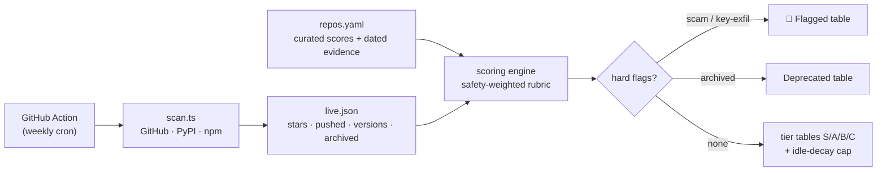
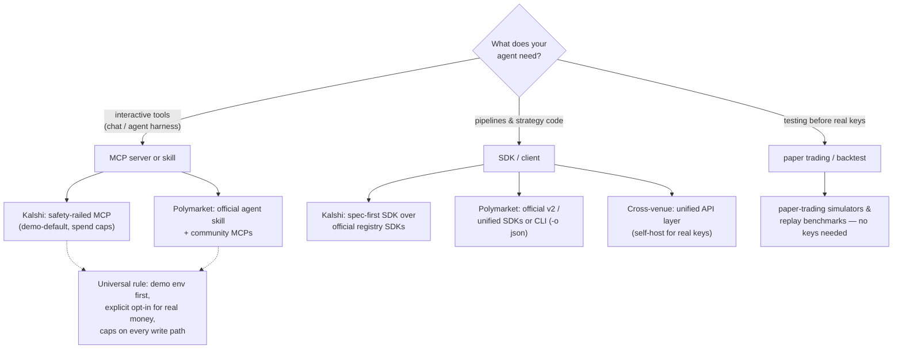
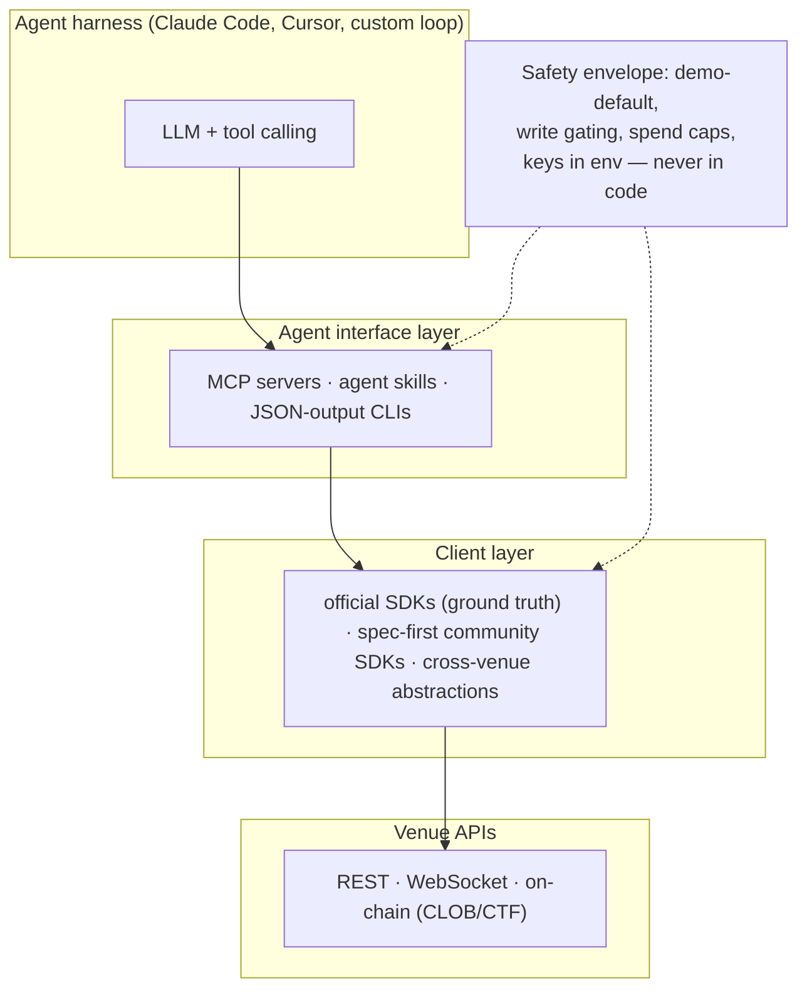

# Prediction Market Agent Atlas

**A verified, continuously-rescanned map of the best — and safest — open-source tooling for connecting LLM agents to prediction markets.**

MCP servers, SDKs, agent skills, CLIs, and backtesting harnesses for **Kalshi** and **Polymarket** (more venues welcome), scored on a safety-weighted rubric with dated evidence per entry, and auto-decayed when repos go stale — so a dead repo can't keep a live recommendation.

---

## Why this exists

Anyone wiring an LLM into a prediction market hits the same three problems:

1. **The ecosystem churns fast.** Both venues replaced their client generations recently — Kalshi's original `kalshi-python` is deprecated in favor of registry-published SDKs; Polymarket archived its v1 CLOB clients and its once-flagship `agents` framework. Third-party writeups routinely recommend the dead generation. *(As of 2026-07-23; the weekly scan keeps the tables below current.)*
2. **Neither venue ships an official MCP server** *(as of 2026-07-23)* — the MCP layer is entirely community-built, so provenance and key-handling vary wildly.
3. **Trading repos are a scam magnet.** Star-farmed "arbitrage bots" and README-only "AI agents" sit next to legitimate tools in every search. Popularity is not a safety signal here — which is why stars are displayed but **never scored**.

The atlas answers: *which repo do I hand my agent — and my API keys — to?*

## How the ranking works

Each entry is scored 0–5 on four **curated** axes (with dated evidence in [`data/repos.yaml`](data/repos.yaml)) plus one **computed** axis:

| Axis | Weight | What it measures |
|---|---|---|
| **Safety** | ×3 | Key handling, demo-by-default, write gating, spend caps, no exfil/telemetry |
| **Provenance** | ×2 | Official org > established maintainer > unknown; inorganic engagement penalized |
| **Capability** | ×2 | Venue API surface: data · WebSocket · orders · portfolio/settlement |
| **Agent fit** | ×2 | MCP/skill-native quality, tool schemas, structured output, agent docs |
| **Maintenance** | ×2 | **Computed** from `max(last push, last release)` — never hand-assigned |

Weighted total → tier: **S** (≥80%) · **A** (≥65%) · **B** (≥45%) · **C**. Hard overrides beat scores: scam/key-exfil flags → 🚩 Flagged; archived → Deprecated; idle >180 days caps the tier at B (unless an official surface is deliberately accepted as dormant). Full rubric with per-level anchors: [docs/methodology.md](docs/methodology.md).

## Choosing your stack

A layered reference architecture (venue-agnostic):

**Read the tables like this:** pick from **S/A tiers** for anything touching real keys; **B** = usable with eyes open; **C** = notable but not recommended; **Deprecated** = read the code, never depend on it; **🚩 Flagged** = do not clone, do not run.

<!-- BEGIN GENERATED RANKINGS (bun scripts/generate-readme.ts) -->

> Curated scores last human-reviewed **2026-07-23** · liveness data as of **2026-07-23** (auto-refreshed weekly by the [scan workflow](.github/workflows/scan.yml)). Score cell shows weighted total, then per-axis: **P**rovenance **C**apability **S**afety **F** agent-fit (each 0–5; maintenance is computed from activity, see [methodology](docs/methodology.md)).

### Kalshi

| Tier | Repo | Category | Score | Stars | Activity | Why / caveats |
|---|---|---|---|---|---|---|
| 🟢 **S** | [`cejor6/kalshi-mcp-server`](https://github.com/cejor6/kalshi-mcp-server) | mcp-server | 47/55 P2 C4 S5 F5 | 1 | pushed 2026-07-19 · v0.1.12 | Strongest safety model surveyed on either venue. Bus factor 1 (single human contributor, self-labeled alpha) — read the code before trusting it with keys; pin the PyPI version. |
| 🟡 **A** | [`kalshi-python-sync`](https://pypi.org/project/kalshi-python-sync/) | sdk-client | 43/55 P5 C4 S3 F3 | — | v3.25.0 | Official REST ground truth (async variant: kalshi-python-async). The deprecated `kalshi-python` package is its predecessor — do not confuse them. |
| 🟡 **A** | [`kalshi-typescript`](https://www.npmjs.com/package/kalshi-typescript) | sdk-client | 43/55 P5 C4 S3 F3 | — | v3.25.0 | Official TS ground truth. |
| 🟡 **A** | [`TexasCoding/kalshi-python-sdk`](https://github.com/TexasCoding/kalshi-python-sdk) | sdk-client | 42/55 P2 C5 S4 F3 | 3 | pushed 2026-07-22 · v7.2.0 | Most complete Kalshi client surveyed. Pin the version; budget upgrade time per major. |
| 🟡 **A** | [`9crusher/mcp-server-kalshi`](https://github.com/9crusher/mcp-server-kalshi) | mcp-server | 40/55 P2 C3 S4 F4 | 22 | pushed 2026-07-09 | Lighter fallback MCP — fewer tools, sane defaults. |
| 🟡 **A** | [`ArshKA/pykalshi`](https://github.com/ArshKA/pykalshi) | sdk-client | 39/55 P3 C4 S3 F3 | 117 | pushed 2026-07-18 · v1.0.6 | Ergonomics layer — pairs well with a spec-first SDK as source of truth. |
| 🟡 **A** | [`newyorkcompute/kalshi`](https://github.com/newyorkcompute/kalshi) | mcp-server | 39/55 P2 C4 S3 F4 | 7 | pushed 2026-07-20 · v0.5.0 | Both MCP and skill in one TS stack. Prefer running from source over the stale npm publishes. |
| 🔵 **B** | [`austron24/kalshi-trader-plugin`](https://github.com/austron24/kalshi-trader-plugin) | agent-framework | 33/55 P2 C3 S3 F5 | 11 | pushed 2025-12-28 | Only surveyed Kalshi tool natively shaped as an agent-harness plugin. |
| 🔵 **B** | [`rmadev01/kalshi-rs`](https://github.com/rmadev01/kalshi-rs) | sdk-client | 31/55 P2 C4 S3 F2 | 2 | pushed 2026-03-13 | Low-latency niche. Unproven; name collision invites dependency mistakes. |
| 🔵 **B** | [`Kalshi/kalshi-starter-code-python`](https://github.com/Kalshi/kalshi-starter-code-python) | sdk-client | 29/55 P5 C2 S3 F2 | 95 | pushed 2025-03-07 | Reference snippets only — the maintained official surface is the registry SDKs. |

### Polymarket

| Tier | Repo | Category | Score | Stars | Activity | Why / caveats |
|---|---|---|---|---|---|---|
| 🟢 **S** | [`Polymarket/agent-skills`](https://github.com/Polymarket/agent-skills) | skill | 48/55 P5 C5 S4 F5 | 178 | pushed 2026-02-19 | The official agent-integration path. Apply a v1→v2 client substitution when following its samples: @polymarket/clob-client-v2 / py-clob-client-v2. |
| 🟡 **A** | [`Polymarket/polymarket-cli`](https://github.com/Polymarket/polymarket-cli) | cli | 43/55 P5 C4 S3 F4 | 2823 | pushed 2026-05-26 | Agent harnesses can drive it via shell with zero MCP plumbing. |
| 🟡 **A** | [`Polymarket/py-clob-client-v2`](https://github.com/Polymarket/py-clob-client-v2) | sdk-client | 43/55 P5 C4 S3 F3 | 163 | pushed 2026-07-17 | TS sibling: @polymarket/clob-client-v2; Rust: rs-clob-client-v2. |
| 🟡 **A** | [`Polymarket/ts-sdk`](https://github.com/Polymarket/ts-sdk) | sdk-client | 43/55 P5 C4 S3 F3 | 25 | pushed 2026-07-22 | Python sibling: Polymarket/py-sdk. Check the registry for the actual published package name before adding a dependency. |
| 🟡 **A** | [`caiovicentino/polymarket-mcp-server`](https://github.com/caiovicentino/polymarket-mcp-server) | mcp-server | 42/55 P1 C5 S4 F4 | 597 | pushed 2026-06-23 | Functional and safety-conscious in code, but treat as a reference implementation rather than a trust anchor until provenance concerns age out. |
| 🟡 **A** | [`demwick/polymarket-agent-mcp`](https://github.com/demwick/polymarket-agent-mcp) | mcp-server | 42/55 P2 C4 S4 F4 | 12 | pushed 2026-07-09 | Best engineering posture among community Polymarket MCPs; depth of the advanced tools (copy-trading, backtest) not independently audited. |
| 🟡 **A** | [`Polymarket/real-time-data-client`](https://github.com/Polymarket/real-time-data-client) | sdk-client | 38/55 P5 C2 S4 F3 | 225 | pushed 2026-03-05 | Pair with a CLOB client when you need writes. |
| 🟡 **A** | [`artvandelay/polymarket-agents`](https://github.com/artvandelay/polymarket-agents) | agent-framework | 37/55 P2 C2 S5 F4 | 3 | pushed 2026-02-12 | Narrow domain, honest scope — a good template for domain-specific paper agents. |
| 🟡 **A** | [`mjunaidca/polymarket-skills`](https://github.com/mjunaidca/polymarket-skills) | skill | 36/55 P2 C3 S4 F4 | 77 | pushed 2026-02-26 | Community alternative to the official skill pack, paper-first. |
| 🔵 **B** | [`ozgureyilmaz/polymarket-mcp`](https://github.com/ozgureyilmaz/polymarket-mcp) | mcp-server | 35/55 P2 C2 S5 F4 | 49 | pushed 2026-01-11 | Clean read-only research server. |
| 🔵 **B** | [`0xrsydn/polymarket-crypto-toolkit`](https://github.com/0xrsydn/polymarket-crypto-toolkit) | data-backtesting | 31/55 P2 C3 S3 F3 | 60 | pushed 2026-02-18 | Solid architecture to mine for backtesting patterns; not a maintained dependency. |
| 🔵 **B** | [`guangxiangdebizi/PolyMarket-MCP`](https://github.com/guangxiangdebizi/PolyMarket-MCP) | mcp-server | 30/55 P1 C3 S4 F3 | 10 | pushed 2025-07-29 | Analytics niche (holders/positions). Hygiene tells; read-only limits the blast radius. |
| 🔵 **B** | [`pab1it0/polymarket-mcp`](https://github.com/pab1it0/polymarket-mcp) | mcp-server | 29/55 P2 C2 S3 F3 | 7 | pushed 2026-03-07 | Simple self-host reference; data-only despite some directories' descriptions. |
| 🔵 **B** | [`berlinbra/polymarket-mcp`](https://github.com/berlinbra/polymarket-mcp) | mcp-server | 26/55 P2 C1 S4 F3 | 142 | pushed 2025-06-06 | Minimal demo-grade server. |
| ⚪ **C** | [`PlayAINetwork/Polymarket-mcp`](https://github.com/PlayAINetwork/Polymarket-mcp) | mcp-server | 19/55 P1 C3 S1 F3 | 3 | pushed 2025-07-07 | Works, but the hardcoded RPC endpoint is disqualifying for real keys. If you must, replace the RPC URL before use. |

### Cross-venue

| Tier | Repo | Category | Score | Stars | Activity | Why / caveats |
|---|---|---|---|---|---|---|
| 🟡 **A** | [`machina-sports/sports-skills`](https://github.com/machina-sports/sports-skills) | skill | 43/55 P3 C2 S5 F4 | 196 | pushed 2026-07-20 | Cleanest pattern for a read-only skill safety contract. |
| 🟡 **A** | [`agent-next/polymarket-paper-trader`](https://github.com/agent-next/polymarket-paper-trader) | data-backtesting | 41/55 P2 C3 S5 F5 | 364 | pushed 2026-03-02 | The dev harness: let agents trade risk-free against live books before any real key exists. |
| 🟡 **A** | [`pmxt-dev/pmxt`](https://github.com/pmxt-dev/pmxt) | sdk-client | 41/55 P3 C4 S3 F4 | 2005 | pushed 2026-07-18 · v2.54.0 | The cross-venue abstraction layer. Self-host for anything involving real keys. |
| 🟡 **A** | [`braedonsaunders/homerun`](https://github.com/braedonsaunders/homerun) | agent-framework | 37/55 P2 C4 S3 F3 | 150 | pushed 2026-07-04 | Architecture reference for cross-venue strategy infra. AGPL — read it, don't vendor it into proprietary code. |
| 🟡 **A** | [`guzus/dr-manhattan`](https://github.com/guzus/dr-manhattan) | sdk-client | 37/55 P2 C4 S3 F3 | 195 | pushed 2026-07-18 | ⚠️ no license · Fully self-hosted pmxt alternative. Resolve the license question before shipping it inside anything. |
| 🟡 **A** | [`SpartanLabsXyz/simmer-sdk`](https://github.com/SpartanLabsXyz/simmer-sdk) | sdk-client | 37/55 P2 C3 S3 F4 | 48 | pushed 2026-07-22 | Young; watch. |
| 🔵 **B** | [`Oddpool/PredictionMarketBench`](https://github.com/Oddpool/PredictionMarketBench) | data-backtesting | 35/55 P2 C2 S5 F3 | 26 | pushed 2026-01-26 | Unique replay dataset angle; small. |
| 🔵 **B** | [`alsk1992/CloddsBot`](https://github.com/alsk1992/CloddsBot) | agent-framework | 34/55 P2 C4 S2 F3 | 528 | pushed 2026-06-26 | Ambitious scope = large key blast radius. Mine for patterns; run nothing with real keys without an audit. |
| 🔵 **B** | [`JamesANZ/prediction-market-mcp`](https://github.com/JamesANZ/prediction-market-mcp) | mcp-server | 32/55 P2 C2 S4 F4 | 36 | pushed 2026-01-16 | Multi-venue read-only scanner. |

### Deprecated / reference-only

Dead or archived code that is still instructive to read — never a dependency.

| Repo | Status | Last activity | Why it's here |
|---|---|---|---|
| [`Polymarket/agents`](https://github.com/Polymarket/agents) | 📦 archived | 2024-11-05 | Historically influential official agent framework — instructive to read, unsafe to build on. Third-party writeups still recommend it as active; they are wrong. |

### 🚩 Flagged — do not run

Entries matching known scam-repo signatures (buying stars, README-only "bots", drainer patterns — the signature list is in [docs/safety.md](docs/safety.md)). Flags are evidence-dated claims, not verdicts on intent; corrections welcome via the [appeal path](CONTRIBUTING.md#corrections--appeals).

| Repo | Status | Evidence |
|---|---|---|
| `brodyautomates/polymarket-pipeline` | 🚩 flagged | 2026-07-23: matches signatures — 367★ four days after creation |
| `casatrick/polymarket-arbitrage-bot-python` | 🚩 flagged | 2026-07-23: matches signatures — arbitrage-bot pitch, engagement pattern inconsistent with history |
| `Cortex-AI-Network/polymarket-copy-trading-bot` | 🚩 flagged | 2026-07-23: matches signatures — copy-trading pitch, org pattern typical of drainer campaigns |
| `cryptomoonday/polymarket-arbitrage-bot` | 🚩 flagged | 2026-07-23: matches signatures — arbitrage-bot pitch, low-provenance account |
| `hanshaze/Awesome-Prediction-Market-Trading-Tools` | 🚩 flagged | 2026-07-23: matches signatures — awesome-list wrapper funneling to flagged bot repos |
| `HarrierOnChain/Prediction-Markets-Trading-Bot-Toolkits` | 🚩 flagged | 2026-07-23: matches signatures — new org, stars(359)≫watchers, forks≈stars, toolkit pitch without inspectable code provenance |
| `kaktusesquire6rmu/ai-polymarket-agent` | 🚩 flagged | 2026-07-23: matches signatures — 218★ with no detected code language (README/binary only) |
| `radioman/polymarket-arbitrage-trading-bot` | 🚩 flagged | 2026-07-23: matches signatures — arbitrage-bot pitch, low-provenance account |
| `reunios2024/cortex-sentinel-trading-nexus` | 🚩 flagged | 2026-07-23: matches signatures — buzzword pitch, throwaway account pattern |

<!-- END GENERATED RANKINGS -->

## Safety essentials

The five rules that survive every venue and every repo (full checklist + scam-signature list: [docs/safety.md](docs/safety.md)):

1. **Demo/paper first.** Both venues have demo environments; several tools are demo-by-default. An agent should earn prod access, not start with it.
2. **Keys live in env vars or a keychain — never in code, config commits, or URLs.** Any repo with a hardcoded third-party endpoint for signed traffic is disqualified from real keys.
3. **Write paths need explicit gates.** Separate read/write tools; require confirm-first order tools or an explicit trading-enable flag; cap order size and daily spend *below* the client if the tool supports it.
4. **Never grant an LLM more than the sub-account it trades can lose.** Venue-side sub-accounts/limits beat any in-repo cap.
5. **Stars are not diligence.** Scam repos buy them. Check contributor history, commit cadence, and whether the code the README describes actually exists.

## Adding a venue or repo

The data model is venue-agnostic: add entries with a new `venue` value in [`data/repos.yaml`](data/repos.yaml) (Limitless, Predict.fun, Drift BET, … — see [CONTRIBUTING.md](CONTRIBUTING.md)). Every entry needs dated evidence; every score needs to match the [methodology anchors](docs/methodology.md). The weekly scan and decay rules apply automatically to anything with a GitHub URL or package ref.

## Honesty notes

- **Curated vs automated:** qualitative scores are human judgments with dated evidence; only liveness (pushed/released/archived/stars) auto-refreshes weekly. The generated tables state both dates.
- **Negative claims rot.** Statements like "no official MCP exists" are dated in place; treat any undated absence claim (here or anywhere) as unverified.
- **Corrections welcome** — especially for 🚩 flags: see the [appeal path](CONTRIBUTING.md#corrections--appeals).

## License

[MIT](LICENSE). Rankings are opinions based on the cited evidence, provided as-is; nothing here is financial advice, and flagged-repo entries are dated pattern-match claims, not assertions about any person's intent.
