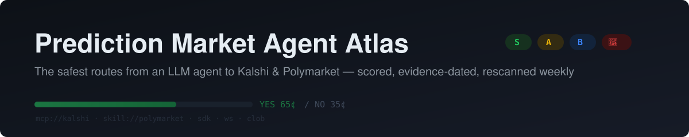
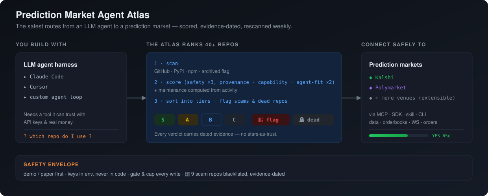

<!-- Prediction Market Agent Atlas -->

&nbsp;&nbsp;&nbsp;&nbsp;

_A verified, continuously-rescanned map of the best — and safest — open-source tooling for connecting LLM agents to prediction markets. MCP servers, SDKs, agent skills, CLIs, and backtesting harnesses for **[Kalshi](https://kalshi.com)** and **[Polymarket](https://polymarket.com)** (more venues welcome), scored on a safety-weighted rubric with dated evidence per entry, and auto-decayed when repos go stale — so a dead repo can't keep a live recommendation. Suitable for builders and traders, with an emphasis on key safety, provenance, and code that actually exists._

 

 

# Table of Contents

- [Why this exists](#why-this-exists)
- [How the ranking works](#how-the-ranking-works)
- [The Rankings](#the-rankings)
  - [Kalshi](#kalshi)
  - [Polymarket](#polymarket)
  - [Cross-venue](#cross-venue)
  - [Deprecated / reference-only](#deprecated--reference-only)
  - [🚩 Flagged — do not run](#-flagged--do-not-run)
- [Safety essentials](#safety-essentials)
- [Diagrams](#diagrams)
- [Adding a venue or repo](#adding-a-venue-or-repo)
- [Honesty notes](#honesty-notes)
- [License](#license)

## Why this exists

Anyone wiring an LLM into a prediction market hits the same three problems:

1. **The ecosystem churns fast.** Both venues replaced their client generations recently — Kalshi's original `kalshi-python` is deprecated in favor of registry-published SDKs; Polymarket archived its v1 CLOB clients and its once-flagship `agents` framework. Third-party writeups routinely recommend the dead generation. *(As of 2026-07-23; the weekly scan keeps the tables below current.)*
2. **Neither venue ships an official MCP server** *(as of 2026-07-23)* — the MCP layer is entirely community-built, so provenance and key-handling vary wildly.
3. **Trading repos are a scam magnet.** Star-farmed "arbitrage bots" and README-only "AI agents" sit next to legitimate tools in every search. Popularity is not a safety signal here — which is why stars are displayed but **never scored**.

The atlas answers: *which repo do I hand my agent — and my API keys — to?*

## How the ranking works

Each entry is scored 0–5 on four **curated** axes (with dated evidence in [`data/repos.yaml`](data/repos.yaml)) plus one **computed** axis:

| Axis | Weight | What it measures |
|---|---|---|
| **Safety** | ×3 | Key handling, demo-by-default, write gating, spend caps, no exfil/telemetry |
| **Provenance** | ×2 | Official org > established maintainer > unknown; inorganic engagement penalized |
| **Capability** | ×2 | Venue API surface: data · WebSocket · orders · portfolio/settlement |
| **Agent fit** | ×2 | MCP/skill-native quality, tool schemas, structured output, agent docs |
| **Maintenance** | ×2 | **Computed** from `max(last push, last release)` — never hand-assigned |

Weighted total → tier: **S** (≥80%) · **A** (≥65%) · **B** (≥45%) · **C**. Hard overrides beat scores: scam/key-exfil flags → 🚩 Flagged; archived → Deprecated; idle >180 days caps the tier at B (unless an official surface is deliberately accepted as dormant). Full rubric with per-level anchors: [docs/methodology.md](docs/methodology.md); the pipeline as a diagram: [scoring-pipeline](diagrams/scoring-pipeline.md).

# The Rankings

**Read the ranking like this:** pick from **🟢 S / 🟡 A** for anything touching real keys; **🔵 B** = usable with eyes open; **⚪ C** = notable but not recommended; **📦 Deprecated** = read the code, never depend on it; **🚩 Flagged** = do not clone, do not run. Health badges under each entry are live (rendered by GitHub on view); tiers and decay compute from the committed weekly scan.

<!-- BEGIN GENERATED RANKINGS (bun scripts/generate-readme.ts) -->

> **44 entries** · curated scores last human-reviewed **2026-07-23** · liveness data as of **2026-07-23** (auto-refreshed weekly by the [scan workflow](.github/workflows/scan.yml)). Each entry shows an **identity row** (repo · grade · weighted score / 55), a short description, then a **per-axis row** — provenance/capability/safety/agent-fit, 0–5 each with a colored marker (🟢 ≥4 · 🟡 3 · 🔴 ≤2); maintenance is computed from activity, see [methodology](docs/methodology.md). The badge strip is live GitHub/registry health.

### Kalshi

| Repo | Grade | Score |
|---|---|---|
| [kalshi-mcp-server](https://github.com/cejor6/kalshi-mcp-server) by [cejor6](https://github.com/cejor6) | 🟢 S-tier | 47/55 |

Strongest safety model surveyed on either venue. Bus factor 1 (single human contributor, self-labeled alpha) — read the code before trusting it with keys; pin the PyPI version.

| provenance: 🔴 2/5 | capability: 🟢 4/5 | safety: 🟢 5/5 | agent-fit: 🟢 5/5 | category: `mcp-server` |
|---|---|---|---|---|

   

---

| Repo | Grade | Score |
|---|---|---|
| [kalshi-python-sync](https://pypi.org/project/kalshi-python-sync/) | 🟡 A-tier | 43/55 |

Official REST ground truth (async variant: kalshi-python-async). The deprecated `kalshi-python` package is its predecessor — do not confuse them.

| provenance: 🟢 5/5 | capability: 🟢 4/5 | safety: 🟡 3/5 | agent-fit: 🟡 3/5 | category: `sdk-client` |
|---|---|---|---|---|

---

| Repo | Grade | Score |
|---|---|---|
| [kalshi-typescript](https://www.npmjs.com/package/kalshi-typescript) | 🟡 A-tier | 43/55 |

Official TS ground truth.

| provenance: 🟢 5/5 | capability: 🟢 4/5 | safety: 🟡 3/5 | agent-fit: 🟡 3/5 | category: `sdk-client` |
|---|---|---|---|---|

---

| Repo | Grade | Score |
|---|---|---|
| [kalshi-python-sdk](https://github.com/TexasCoding/kalshi-python-sdk) by [TexasCoding](https://github.com/TexasCoding) | 🟡 A-tier | 42/55 |

Most complete Kalshi client surveyed. Pin the version; budget upgrade time per major.

| provenance: 🔴 2/5 | capability: 🟢 5/5 | safety: 🟢 4/5 | agent-fit: 🟡 3/5 | category: `sdk-client` |
|---|---|---|---|---|

   

---

| Repo | Grade | Score |
|---|---|---|
| [mcp-server-kalshi](https://github.com/9crusher/mcp-server-kalshi) by [9crusher](https://github.com/9crusher) | 🟡 A-tier | 40/55 |

Lighter fallback MCP — fewer tools, sane defaults.

| provenance: 🔴 2/5 | capability: 🟡 3/5 | safety: 🟢 4/5 | agent-fit: 🟢 4/5 | category: `mcp-server` |
|---|---|---|---|---|

  

---

| Repo | Grade | Score |
|---|---|---|
| [pykalshi](https://github.com/ArshKA/pykalshi) by [ArshKA](https://github.com/ArshKA) | 🟡 A-tier | 39/55 |

Ergonomics layer — pairs well with a spec-first SDK as source of truth.

| provenance: 🟡 3/5 | capability: 🟢 4/5 | safety: 🟡 3/5 | agent-fit: 🟡 3/5 | category: `sdk-client` |
|---|---|---|---|---|

   

---

| Repo | Grade | Score |
|---|---|---|
| [kalshi](https://github.com/newyorkcompute/kalshi) by [newyorkcompute](https://github.com/newyorkcompute) | 🟡 A-tier | 39/55 |

Both MCP and skill in one TS stack. Prefer running from source over the stale npm publishes.

| provenance: 🔴 2/5 | capability: 🟢 4/5 | safety: 🟡 3/5 | agent-fit: 🟢 4/5 | category: `mcp-server` |
|---|---|---|---|---|

   

---

| Repo | Grade | Score |
|---|---|---|
| [kalshi-trader-plugin](https://github.com/austron24/kalshi-trader-plugin) by [austron24](https://github.com/austron24) | 🔵 B-tier | 33/55 |

Only surveyed Kalshi tool natively shaped as an agent-harness plugin.

| provenance: 🔴 2/5 | capability: 🟡 3/5 | safety: 🟡 3/5 | agent-fit: 🟢 5/5 | category: `agent-framework` |
|---|---|---|---|---|

  

---

| Repo | Grade | Score |
|---|---|---|
| [kalshi-rs](https://github.com/rmadev01/kalshi-rs) by [rmadev01](https://github.com/rmadev01) | 🔵 B-tier | 31/55 |

Low-latency niche. Unproven; name collision invites dependency mistakes.

| provenance: 🔴 2/5 | capability: 🟢 4/5 | safety: 🟡 3/5 | agent-fit: 🔴 2/5 | category: `sdk-client` |
|---|---|---|---|---|

  

---

| Repo | Grade | Score |
|---|---|---|
| [kalshi-starter-code-python](https://github.com/Kalshi/kalshi-starter-code-python) by [Kalshi](https://github.com/Kalshi) | 🔵 B-tier | 29/55 |

Reference snippets only — the maintained official surface is the registry SDKs.

| provenance: 🟢 5/5 | capability: 🔴 2/5 | safety: 🟡 3/5 | agent-fit: 🔴 2/5 | category: `sdk-client` |
|---|---|---|---|---|

  

### Polymarket

| Repo | Grade | Score |
|---|---|---|
| [agent-skills](https://github.com/Polymarket/agent-skills) by [Polymarket](https://github.com/Polymarket) | 🟢 S-tier | 48/55 |

The official agent-integration path. Apply a v1→v2 client substitution when following its samples: @polymarket/clob-client-v2 / py-clob-client-v2.

| provenance: 🟢 5/5 | capability: 🟢 5/5 | safety: 🟢 4/5 | agent-fit: 🟢 5/5 | category: `skill` |
|---|---|---|---|---|

  

---

| Repo | Grade | Score |
|---|---|---|
| [polymarket-cli](https://github.com/Polymarket/polymarket-cli) by [Polymarket](https://github.com/Polymarket) | 🟡 A-tier | 43/55 |

Agent harnesses can drive it via shell with zero MCP plumbing.

| provenance: 🟢 5/5 | capability: 🟢 4/5 | safety: 🟡 3/5 | agent-fit: 🟢 4/5 | category: `cli` |
|---|---|---|---|---|

  

---

| Repo | Grade | Score |
|---|---|---|
| [py-clob-client-v2](https://github.com/Polymarket/py-clob-client-v2) by [Polymarket](https://github.com/Polymarket) | 🟡 A-tier | 43/55 |

TS sibling: @polymarket/clob-client-v2; Rust: rs-clob-client-v2.

| provenance: 🟢 5/5 | capability: 🟢 4/5 | safety: 🟡 3/5 | agent-fit: 🟡 3/5 | category: `sdk-client` |
|---|---|---|---|---|

   

---

| Repo | Grade | Score |
|---|---|---|
| [ts-sdk](https://github.com/Polymarket/ts-sdk) by [Polymarket](https://github.com/Polymarket) | 🟡 A-tier | 43/55 |

Python sibling: Polymarket/py-sdk. Check the registry for the actual published package name before adding a dependency.

| provenance: 🟢 5/5 | capability: 🟢 4/5 | safety: 🟡 3/5 | agent-fit: 🟡 3/5 | category: `sdk-client` |
|---|---|---|---|---|

  

---

| Repo | Grade | Score |
|---|---|---|
| [polymarket-mcp-server](https://github.com/caiovicentino/polymarket-mcp-server) by [caiovicentino](https://github.com/caiovicentino) | 🟡 A-tier | 42/55 |

Functional and safety-conscious in code, but treat as a reference implementation rather than a trust anchor until provenance concerns age out.

| provenance: 🔴 1/5 | capability: 🟢 5/5 | safety: 🟢 4/5 | agent-fit: 🟢 4/5 | category: `mcp-server` |
|---|---|---|---|---|

  

---

| Repo | Grade | Score |
|---|---|---|
| [polymarket-agent-mcp](https://github.com/demwick/polymarket-agent-mcp) by [demwick](https://github.com/demwick) | 🟡 A-tier | 42/55 |

Best engineering posture among community Polymarket MCPs; depth of the advanced tools (copy-trading, backtest) not independently audited.

| provenance: 🔴 2/5 | capability: 🟢 4/5 | safety: 🟢 4/5 | agent-fit: 🟢 4/5 | category: `mcp-server` |
|---|---|---|---|---|

  

---

| Repo | Grade | Score |
|---|---|---|
| [real-time-data-client](https://github.com/Polymarket/real-time-data-client) by [Polymarket](https://github.com/Polymarket) | 🟡 A-tier | 38/55 |

Pair with a CLOB client when you need writes.

| provenance: 🟢 5/5 | capability: 🔴 2/5 | safety: 🟢 4/5 | agent-fit: 🟡 3/5 | category: `sdk-client` |
|---|---|---|---|---|

   

---

| Repo | Grade | Score |
|---|---|---|
| [polymarket-agents](https://github.com/artvandelay/polymarket-agents) by [artvandelay](https://github.com/artvandelay) | 🟡 A-tier | 37/55 |

Narrow domain, honest scope — a good template for domain-specific paper agents.

| provenance: 🔴 2/5 | capability: 🔴 2/5 | safety: 🟢 5/5 | agent-fit: 🟢 4/5 | category: `agent-framework` |
|---|---|---|---|---|

  

---

| Repo | Grade | Score |
|---|---|---|
| [polymarket-skills](https://github.com/mjunaidca/polymarket-skills) by [mjunaidca](https://github.com/mjunaidca) | 🟡 A-tier | 36/55 |

Community alternative to the official skill pack, paper-first.

| provenance: 🔴 2/5 | capability: 🟡 3/5 | safety: 🟢 4/5 | agent-fit: 🟢 4/5 | category: `skill` |
|---|---|---|---|---|

  

---

| Repo | Grade | Score |
|---|---|---|
| [polymarket-mcp](https://github.com/ozgureyilmaz/polymarket-mcp) by [ozgureyilmaz](https://github.com/ozgureyilmaz) | 🔵 B-tier | 35/55 |

Clean read-only research server.

| provenance: 🔴 2/5 | capability: 🔴 2/5 | safety: 🟢 5/5 | agent-fit: 🟢 4/5 | category: `mcp-server` |
|---|---|---|---|---|

  

---

| Repo | Grade | Score |
|---|---|---|
| [polymarket-crypto-toolkit](https://github.com/0xrsydn/polymarket-crypto-toolkit) by [0xrsydn](https://github.com/0xrsydn) | 🔵 B-tier | 31/55 |

Solid architecture to mine for backtesting patterns; not a maintained dependency.

| provenance: 🔴 2/5 | capability: 🟡 3/5 | safety: 🟡 3/5 | agent-fit: 🟡 3/5 | category: `data-backtesting` |
|---|---|---|---|---|

  

---

| Repo | Grade | Score |
|---|---|---|
| [PolyMarket-MCP](https://github.com/guangxiangdebizi/PolyMarket-MCP) by [guangxiangdebizi](https://github.com/guangxiangdebizi) | 🔵 B-tier | 30/55 |

Analytics niche (holders/positions). Hygiene tells; read-only limits the blast radius.

| provenance: 🔴 1/5 | capability: 🟡 3/5 | safety: 🟢 4/5 | agent-fit: 🟡 3/5 | category: `mcp-server` |
|---|---|---|---|---|

  

---

| Repo | Grade | Score |
|---|---|---|
| [polymarket-mcp](https://github.com/pab1it0/polymarket-mcp) by [pab1it0](https://github.com/pab1it0) | 🔵 B-tier | 29/55 |

Simple self-host reference; data-only despite some directories' descriptions.

| provenance: 🔴 2/5 | capability: 🔴 2/5 | safety: 🟡 3/5 | agent-fit: 🟡 3/5 | category: `mcp-server` |
|---|---|---|---|---|

  

---

| Repo | Grade | Score |
|---|---|---|
| [polymarket-mcp](https://github.com/berlinbra/polymarket-mcp) by [berlinbra](https://github.com/berlinbra) | 🔵 B-tier | 26/55 |

Minimal demo-grade server.

| provenance: 🔴 2/5 | capability: 🔴 1/5 | safety: 🟢 4/5 | agent-fit: 🟡 3/5 | category: `mcp-server` |
|---|---|---|---|---|

  

---

| Repo | Grade | Score |
|---|---|---|
| [Polymarket-mcp](https://github.com/PlayAINetwork/Polymarket-mcp) by [PlayAINetwork](https://github.com/PlayAINetwork) | ⚪ C-tier | 19/55 |

Works, but the hardcoded RPC endpoint is disqualifying for real keys. If you must, replace the RPC URL before use.

| provenance: 🔴 1/5 | capability: 🟡 3/5 | safety: 🔴 1/5 | agent-fit: 🟡 3/5 | category: `mcp-server` |
|---|---|---|---|---|

  

### Cross-venue

| Repo | Grade | Score |
|---|---|---|
| [sports-skills](https://github.com/machina-sports/sports-skills) by [machina-sports](https://github.com/machina-sports) | 🟡 A-tier | 43/55 |

Cleanest pattern for a read-only skill safety contract.

| provenance: 🟡 3/5 | capability: 🔴 2/5 | safety: 🟢 5/5 | agent-fit: 🟢 4/5 | category: `skill` |
|---|---|---|---|---|

  

---

| Repo | Grade | Score |
|---|---|---|
| [pmxt](https://github.com/pmxt-dev/pmxt) by [pmxt-dev](https://github.com/pmxt-dev) | 🟡 A-tier | 41/55 |

The cross-venue abstraction layer. Self-host for anything involving real keys.

| provenance: 🟡 3/5 | capability: 🟢 4/5 | safety: 🟡 3/5 | agent-fit: 🟢 4/5 | category: `sdk-client` |
|---|---|---|---|---|

   

---

| Repo | Grade | Score |
|---|---|---|
| [polymarket-paper-trader](https://github.com/agent-next/polymarket-paper-trader) by [agent-next](https://github.com/agent-next) | 🟡 A-tier | 41/55 |

The dev harness: let agents trade risk-free against live books before any real key exists.

| provenance: 🔴 2/5 | capability: 🟡 3/5 | safety: 🟢 5/5 | agent-fit: 🟢 5/5 | category: `data-backtesting` |
|---|---|---|---|---|

   

---

| Repo | Grade | Score |
|---|---|---|
| [dr-manhattan](https://github.com/guzus/dr-manhattan) by [guzus](https://github.com/guzus) | 🟡 A-tier | 37/55 |

**⚠️ no license.** Fully self-hosted pmxt alternative. Resolve the license question before shipping it inside anything.

| provenance: 🔴 2/5 | capability: 🟢 4/5 | safety: 🟡 3/5 | agent-fit: 🟡 3/5 | category: `sdk-client` |
|---|---|---|---|---|

  

---

| Repo | Grade | Score |
|---|---|---|
| [homerun](https://github.com/braedonsaunders/homerun) by [braedonsaunders](https://github.com/braedonsaunders) | 🟡 A-tier | 37/55 |

Architecture reference for cross-venue strategy infra. AGPL — read it, don't vendor it into proprietary code.

| provenance: 🔴 2/5 | capability: 🟢 4/5 | safety: 🟡 3/5 | agent-fit: 🟡 3/5 | category: `agent-framework` |
|---|---|---|---|---|

  

---

| Repo | Grade | Score |
|---|---|---|
| [simmer-sdk](https://github.com/SpartanLabsXyz/simmer-sdk) by [SpartanLabsXyz](https://github.com/SpartanLabsXyz) | 🟡 A-tier | 37/55 |

Young; watch.

| provenance: 🔴 2/5 | capability: 🟡 3/5 | safety: 🟡 3/5 | agent-fit: 🟢 4/5 | category: `sdk-client` |
|---|---|---|---|---|

  

---

| Repo | Grade | Score |
|---|---|---|
| [PredictionMarketBench](https://github.com/Oddpool/PredictionMarketBench) by [Oddpool](https://github.com/Oddpool) | 🔵 B-tier | 35/55 |

Unique replay dataset angle; small.

| provenance: 🔴 2/5 | capability: 🔴 2/5 | safety: 🟢 5/5 | agent-fit: 🟡 3/5 | category: `data-backtesting` |
|---|---|---|---|---|

  

---

| Repo | Grade | Score |
|---|---|---|
| [CloddsBot](https://github.com/alsk1992/CloddsBot) by [alsk1992](https://github.com/alsk1992) | 🔵 B-tier | 34/55 |

Ambitious scope = large key blast radius. Mine for patterns; run nothing with real keys without an audit.

| provenance: 🔴 2/5 | capability: 🟢 4/5 | safety: 🔴 2/5 | agent-fit: 🟡 3/5 | category: `agent-framework` |
|---|---|---|---|---|

  

---

| Repo | Grade | Score |
|---|---|---|
| [prediction-market-mcp](https://github.com/JamesANZ/prediction-market-mcp) by [JamesANZ](https://github.com/JamesANZ) | 🔵 B-tier | 32/55 |

Multi-venue read-only scanner.

| provenance: 🔴 2/5 | capability: 🔴 2/5 | safety: 🟢 4/5 | agent-fit: 🟢 4/5 | category: `mcp-server` |
|---|---|---|---|---|

  

### Deprecated / reference-only

Dead or archived code that is still instructive to read — never a dependency.

| Repo | Status | Last activity | Why it's here |
|---|---|---|---|
| [`Polymarket/agents`](https://github.com/Polymarket/agents) | 📦 archived | 2024-11-05 | Historically influential official agent framework — instructive to read, unsafe to build on. Third-party writeups still recommend it as active; they are wrong. |

### 🚩 Flagged — do not run

Entries matching known scam-repo signatures (buying stars, README-only "bots", drainer patterns — the signature list is in [docs/safety.md](docs/safety.md)). Flags are evidence-dated claims, not verdicts on intent; corrections welcome via the [appeal path](CONTRIBUTING.md#corrections--appeals).

| Repo | Status | Evidence |
|---|---|---|
| `brodyautomates/polymarket-pipeline` | 🚩 flagged | 2026-07-23: matches signatures — 367★ four days after creation |
| `casatrick/polymarket-arbitrage-bot-python` | 🚩 flagged | 2026-07-23: matches signatures — arbitrage-bot pitch, engagement pattern inconsistent with history |
| `Cortex-AI-Network/polymarket-copy-trading-bot` | 🪦 taken down since flagging | 2026-07-23: matches signatures — copy-trading pitch, org pattern typical of drainer campaigns |
| `cryptomoonday/polymarket-arbitrage-bot` | 🚩 flagged | 2026-07-23: matches signatures — arbitrage-bot pitch, low-provenance account |
| `hanshaze/Awesome-Prediction-Market-Trading-Tools` | 🚩 flagged | 2026-07-23: matches signatures — awesome-list wrapper funneling to flagged bot repos |
| `HarrierOnChain/Prediction-Markets-Trading-Bot-Toolkits` | 🚩 flagged | 2026-07-23: matches signatures — new org, stars(359)≫watchers, forks≈stars, toolkit pitch without inspectable code provenance |
| `kaktusesquire6rmu/ai-polymarket-agent` | 🚩 flagged | 2026-07-23: matches signatures — 218★ with no detected code language (README/binary only) |
| `radioman/polymarket-arbitrage-trading-bot` | 🚩 flagged | 2026-07-23: matches signatures — arbitrage-bot pitch, low-provenance account |
| `reunios2024/cortex-sentinel-trading-nexus` | 🚩 flagged | 2026-07-23: matches signatures — buzzword pitch, throwaway account pattern |

<!-- END GENERATED RANKINGS -->

## Safety essentials

The five rules that survive every venue and every repo (full checklist + scam-signature list: [docs/safety.md](docs/safety.md)):

1. **Demo/paper first.** Both venues have demo environments; several tools are demo-by-default. An agent should earn prod access, not start with it.
2. **Keys live in env vars or a keychain — never in code, config commits, or URLs.** Any repo with a hardcoded third-party endpoint for signed traffic is disqualified from real keys.
3. **Write paths need explicit gates.** Separate read/write tools; require confirm-first order tools or an explicit trading-enable flag; cap order size and daily spend *below* the client if the tool supports it.
4. **Never grant an LLM more than the sub-account it trades can lose.** Venue-side sub-accounts/limits beat any in-repo cap.
5. **Stars are not diligence.** Scam repos buy them. Check contributor history, commit cadence, and whether the code the README describes actually exists.

## Diagrams

Kept in [`diagrams/`](diagrams/) so this page stays scannable — all render on GitHub:

| Diagram | Shows |
|---|---|
| [Scoring pipeline](diagrams/scoring-pipeline.md) | How a repo becomes a tier: scan → score → sort / flag |
| [Choosing your stack](diagrams/choosing-your-stack.md) | Which kind of tool for which need |
| [Reference architecture](diagrams/reference-architecture.md) | The venue-agnostic layers an agent stacks |

## Adding a venue or repo

The data model is venue-agnostic: add entries with a new `venue` value in [`data/repos.yaml`](data/repos.yaml) (Limitless, Predict.fun, Drift BET, … — see [CONTRIBUTING.md](CONTRIBUTING.md)). Every entry needs dated evidence; every score needs to match the [methodology anchors](docs/methodology.md). The weekly scan and decay rules apply automatically to anything with a GitHub URL or package ref.

## Honesty notes

- **Curated vs automated:** qualitative scores are human judgments with dated evidence; only liveness (pushed/released/archived/stars) auto-refreshes weekly. The generated tables state both dates.
- **Negative claims rot.** Statements like "no official MCP exists" are dated in place; treat any undated absence claim (here or anywhere) as unverified.
- **Corrections welcome** — especially for 🚩 flags: see the [appeal path](CONTRIBUTING.md#corrections--appeals).

## License

[MIT](LICENSE). Rankings are opinions based on the cited evidence, provided as-is; nothing here is financial advice, and flagged-repo entries are dated pattern-match claims, not assertions about any person's intent.
