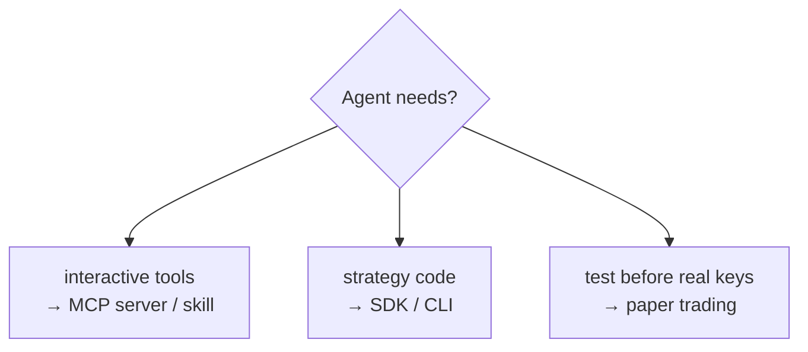

# Choosing your stack

Start from what your agent needs. Whatever the branch, the same rule holds: **demo/paper first, opt in to real money explicitly, cap every write.**

[← back to README](../README.md)
