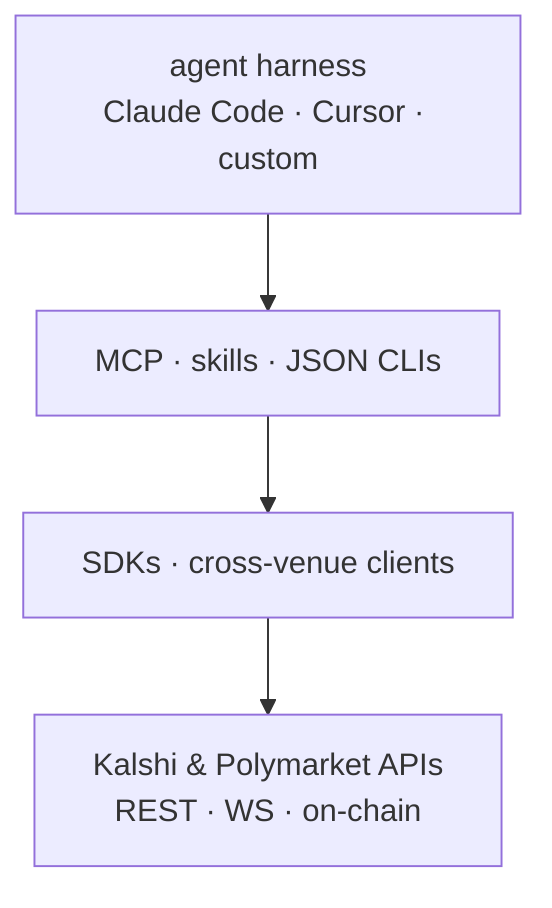

# Reference architecture

The venue-agnostic layers an agent stacks to reach a market. Official SDKs are the ground-truth client layer; MCP servers, skills, and JSON-output CLIs sit above them as the agent interface.

Keys live in env, never in code; writes are gated and capped at every layer.

[← back to README](../README.md)
