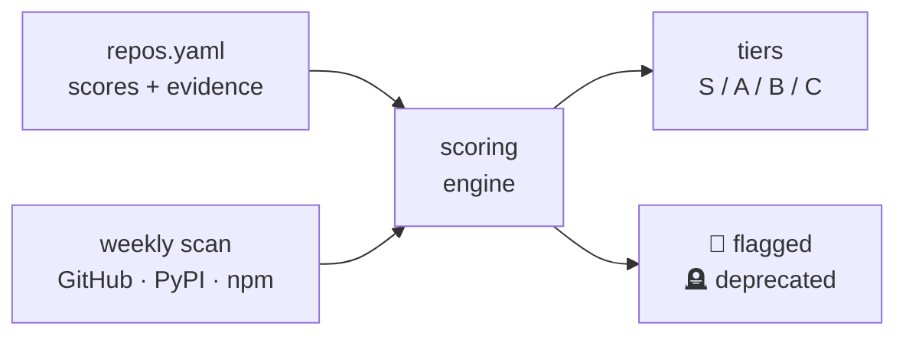

# Scoring pipeline

How a repo becomes a tier. Curated scores + a weekly liveness scan feed one engine; hard flags divert dangerous or dead repos out of the ranked tiers. Full rubric: [docs/methodology.md](../docs/methodology.md).

[← back to README](../README.md)
